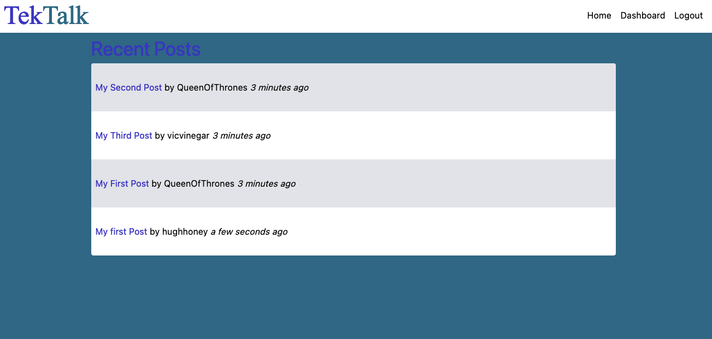

# TekTalk

A small tech blog CMS written using:

- Express.js
- Sequelize ORM
- dotenv
- bcrypt
- handlebars
- and more...

## License

This application is open-sourced software and is licensed under the terms of the [MIT License](https://opensource.org/licenses/MIT).

## Demo

## Questions
Have additional questions? I can be reached at [Github](https://github.com/mcarson24) or you can e-mail me at matthew.carson@pm.me.